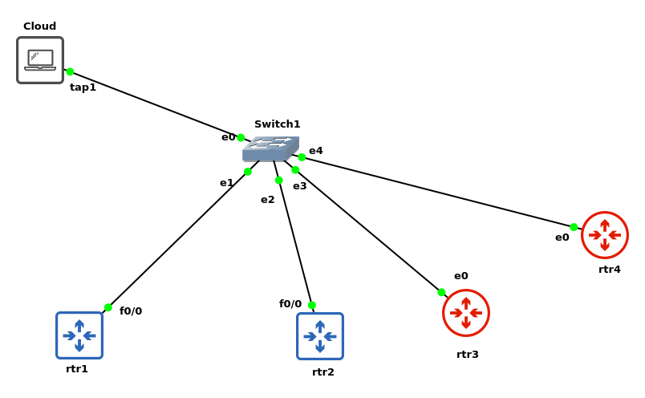

# Paramiko-NetworkAutomation-CSV

Automation script for Cisco & Mikrotik devices. Contains ```CSV``` file as device information.

## Build

```bash
git clone https://github.com/danielcristho/paramiko-na-csv.git && cd paramiko-na-csv
python3 -m venv env
source env/bin/activate
pip install -r requirements.txt
```

You need to specify devices information on ```list-devices.csv```

